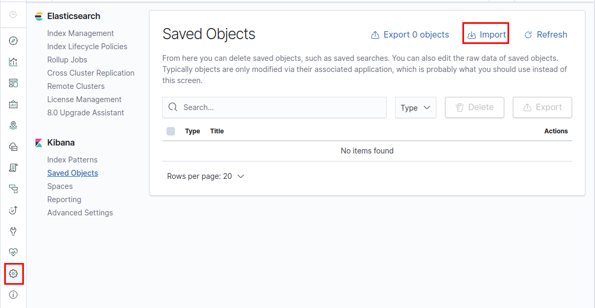
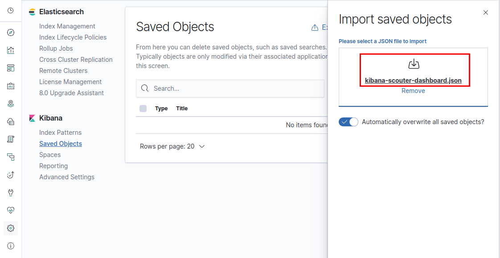
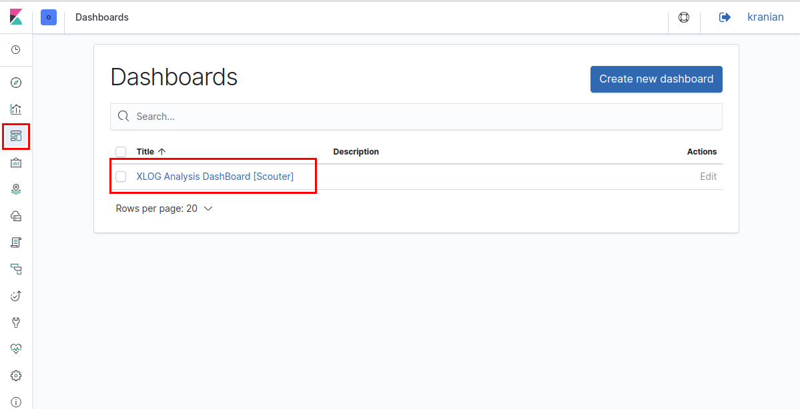
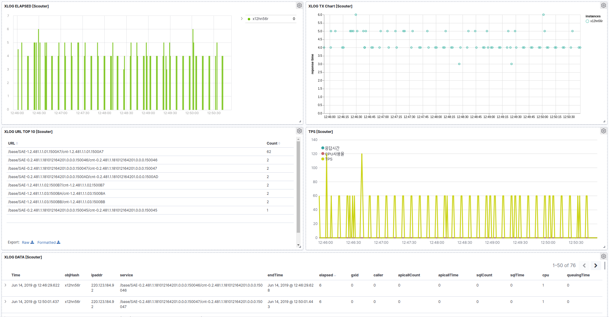

# scouter-plugin-server-elasticsearch                                              

- Scouter Server Plugin으로 성능 counter 정보 와 XLOG 정보를 ElasticSearch 로 전송해 주는 plugin 이다.  
- elasticsearch 이란? 아래 링크에서 키바나,엘라스틱 서치 간략한 개념과 설치 및 키바나에 사용법을 이해 하실 수 있습니다. 
  - https://github.com/higee/elastic/blob/master/README.md

### configuration (스카우터 서버 설치 경로 하위의 conf/scouter.conf)
#### 기본 설정
* **ext_plugin_es_enabled** : 본 plugin 사용 여부 (default : true)
* **ext_plugin_es_counter_index** : elasticsearch counter index 명 (default : scouter-counter)
* **ext_plugin_es_xlog_index** :  elasticsearch xlog index 명 (default : scouter-xlog)
* **ext_plugin_ex_duration_day** : elasticsearch index 저장 기간 (default : 90)

#### http 방식 연동 여부 설정
* **ext_plugin_es_https_enabled** : https 사용 여부  (default : http 사용)
* **ext_plugin_es_cluster_address** : http target(elasticsearch) address (default : 127.0.0.1:9200)
  - 엘라스틱서치를  쿨러스터로 운영 중면 콤마로 구분 지어 붙인다. ex) 127.0.0.1:9200,127.0.0.1:9201      
* **ext_plugin_es_id** : (default : empty)
* **ext_plugin_es_password** : (default : empty)
    
### dependencies
Refer to [pom.xml](./pom.xml)

### Build environment 
 - Java 1.8.x
 - Maven 3.x 

### Build
 - mvn clean install
    
### Deploy
 - target에 생성되는 scouter-plugin-server-elasticsearch-x.x.x.jar 와 target/lib에 생성되는 전체 library를 scouter sever의 lib 디렉토리에 저장하고 scouter server를 재시작한다
### Support Scouter Version
 - 2.0.x 이상  
### Support ElasticSearch Version
 - 7.0.1   
### How To Kibana import 
#### 1. 키바나 관리 메뉴로 이동 Saved Objects 클릭 후 Import를 클릭 한다.  

#### 2. 해당 프로젝트 export 폴더에서 kibana-scouter-dashboard.json 파일을 마우스로 import saved objects에 드래앤 드랍을 하면 잠시 후 로딩 성공 메시지를 확인 하고 OK 버튼을 누른다. 

[kibana-scouter-dashboard.json 다운로드](./export/kibana-scouter-dashboard.json)
#### 4. 대시 보드 메뉴로 이동 XLOG Analysis Dashboard 찾아 클릭한다.  

#### 5. 화면 결과  

